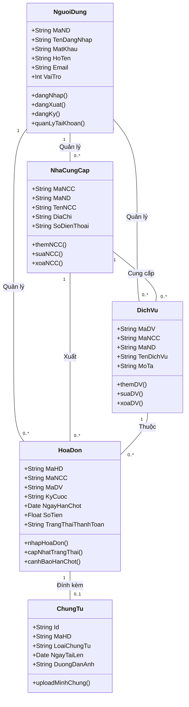
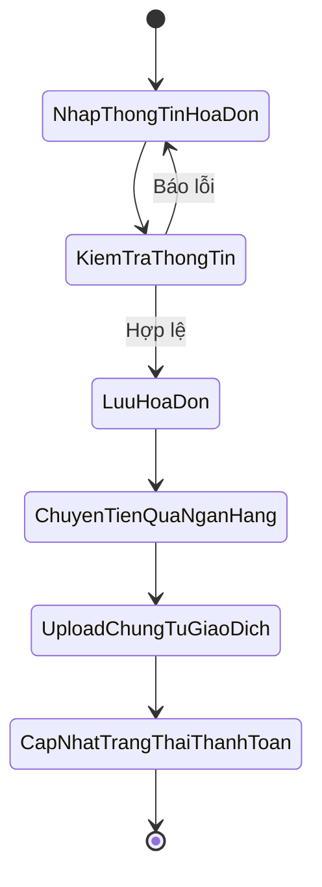

TRƯỜNG ĐẠI HỌC CỬU LONG
**BÀI BÁO CÁO**

**Môn học:** Chuyên đề web
**Đề tài:** Xây dựng Ứng dụng Web Quản lý Chi tiêu và Tiện ích cá nhân
**Giảng Viên:** TH.S Phạm Thị Hồng Thu
**Lớp:** ĐHCNTT – K6
**Nhóm thực hiện:** Nhóm 2
**Sinh viên thực hiện:**

* Trương Nam Trung – MSSV: 06130200011

Vĩnh Long, tháng 08 năm 2026

---

### MỤC LỤC

---

### CHƯƠNG 1: GIỚI THIỆU BÀI BÁO CÁO

**1. Lý do chọn đề tài**
Trong cuộc sống hiện đại, việc theo dõi và thanh toán đúng hạn các hóa đơn sinh hoạt định kỳ (điện, nước, internet, phí dịch vụ...) là một nhu cầu thiết yếu. Việc ghi chép thủ công dễ dẫn đến sai sót, thất lạc biên lai hoặc quên hạn thanh toán gây phát sinh phí phạt. Xây dựng một hệ thống website cá nhân hóa giúp tập trung toàn bộ dữ liệu thu chi, cảnh báo đến hạn và lưu trữ chứng từ điện tử là một giải pháp cấp thiết và mang tính thực tiễn cao.

**2. Mục tiêu của đề tài**

* Vận dụng các kiến thức đã học trong Giáo trình Chuyên đề Web (Mô hình MVC, PHP thuần, thao tác CSDL) để xây dựng một ứng dụng hoàn chỉnh.


* Tạo ra công cụ trực quan giúp người dùng dễ dàng theo dõi dòng tiền và phân tích mức độ tiêu thụ hàng tháng.


* Hỗ trợ lập kế hoạch điều chỉnh chi tiêu hợp lý dựa trên dữ liệu thực tế.


**3. Phạm vi và đối tượng sử dụng**

* **Đối tượng:** Cá nhân, hộ gia đình hoặc sinh viên muốn quản lý ngân sách sinh hoạt.


* **Phạm vi:** Tập trung vào việc quản lý các khoản chi cố định (tiện ích định kỳ) thay vì đi sâu vào các khoản chi lặt vặt hàng ngày.


---

### CHƯƠNG 2: YÊU CẦU BÀI TOÁN & CHỨC NĂNG CỐT LÕI

Hệ thống được thiết kế với các module chức năng chính sau:

**1. Quản lý danh mục dịch vụ**

* Thêm, sửa, xóa, xem danh sách các đơn vị cung cấp dịch vụ.

* Ví dụ: EVN, Cấp nước Cần Thơ, Viettel, FPT....

**2. Quản lý hóa đơn và chỉ số tiêu thụ**

* Nhập liệu số tiền cần thanh toán cho từng kỳ cước.
* Theo dõi các chỉ số đầu/cuối (số kWh điện, số khối nước) để tiện đối chiếu.

**3. Cảnh báo thanh toán**

* Hệ thống tự động so sánh ngày hiện tại với `NgayHanChot` của các hóa đơn chưa thanh toán.

* Đưa ra cảnh báo nổi bật ngay trên cùng của trang chủ (Dashboard) với khung màu đỏ (Alert) kèm danh sách các hóa đơn sắp đến hạn (trong vòng 7 ngày) hoặc đã quá hạn thanh toán.

**4. Lưu trữ và đối chiếu giao dịch**

* Cập nhật trạng thái "Đã thanh toán".

* Ghi nhận nền tảng thực hiện giao dịch (Ví dụ: VPBank NEO, VCB Digibank, MoMo...).

* **Quản lý chứng từ điện tử (Upload File):** Cho phép tải lên (upload) và đính kèm hình ảnh biên lai giấy hoặc ảnh chụp màn hình chuyển khoản thành công lưu trữ trên server.


**5. Thống kê và báo cáo trực quan**

* Lọc dữ liệu thu chi theo khoảng thời gian (công cụ "Chọn tháng").

* **Bảng điều khiển (Dashboard) thông minh:** Tích hợp trực tiếp màn hình thống kê vào trang chủ.
  * Hiển thị các Thẻ thông tin (Cards) tóm tắt: Thông tin người dùng (Họ tên, lần đăng nhập cuối), Tổng số lượng hóa đơn chưa thanh toán, và Tổng tiền cần thanh toán.
  * Các thẻ thông tin được tích hợp liên kết (lối tắt) giúp người dùng nhấp vào để chuyển thẳng đến màn hình Quản lý Hóa đơn.
* **Biểu đồ động:** 
  * Khi không chọn tháng: Hiển thị Biểu đồ cột (Bar Chart) so sánh tổng chi phí hóa đơn theo từng kỳ cước.
  * Khi chọn 1 tháng cụ thể: Hệ thống tự động chuyển sang Biểu đồ tròn (Pie Chart) thể hiện cơ cấu phần trăm chi phí của từng dịch vụ trong tháng đó.


---

### CHƯƠNG 3: PHÂN TÍCH VÀ THIẾT KẾ HỆ THỐNG (KÈM UML)

#### 1. Các mô hình UML

**1.1. Biểu đồ Use Case (Use Case Diagram)**
Biểu đồ mô tả các chức năng tương tác cốt lõi của người dùng với hệ thống quản lý chi tiêu.

```mermaid
usecaseDiagram
    actor Nguoi_Dung as "Người Dùng"
    
    package "Hệ thống Quản lý Chi tiêu và Tiện ích" {
        usecase UC_DangNhap as "Đăng nhập"
        
        usecase UC1 as "Quản lý danh mục dịch vụ"
        usecase UC2 as "Quản lý hóa đơn và chỉ số"
        usecase UC3 as "Xem cảnh báo thanh toán"
        usecase UC4 as "Cập nhật thanh toán"
        usecase UC4_1 as "Upload chứng từ"
        usecase UC5 as "Xem thống kê và báo cáo"
        usecase UC5_1 as "Xuất file (PDF/Excel)"
    }
    
    %% Mối quan hệ giữa Actor và các Use Case chính
    Nguoi_Dung --> UC_DangNhap
    Nguoi_Dung --> UC1
    Nguoi_Dung --> UC2
    Nguoi_Dung --> UC3
    Nguoi_Dung --> UC4
    Nguoi_Dung --> UC5
    
    %% Mối quan hệ Include (Bắt buộc)
    UC4 ..> UC4_1 : <<include>>
    
    %% Mối quan hệ Extend (Tùy chọn/Mở rộng)
    UC5 <.. UC5_1 : <<extend>>

```

**1.2. Biểu đồ Lớp (Class Diagram)**
Dựa trên cấu trúc cơ sở dữ liệu được định nghĩa, hệ thống bao gồm 4 lớp thực thể chính có mối quan hệ trực tiếp với nhau, trong đó có bổ sung lớp Người dùng để quản lý dữ liệu cá nhân hóa.



**1.3. Biểu đồ Hoạt động (Activity Diagram) - Quy trình thanh toán và lưu chứng từ**



#### 2. Thiết kế cơ sở dữ liệu

Hệ thống sử dụng các bảng chính được liên kết với nhau qua khóa ngoại:

* **NguoiDung:** MaND (PK), TenDangNhap, MatKhau, HoTen, Email, VaiTro (0: Người dùng, 1: Quản trị viên).

* **NhaCungCap:** MaNCC (PK), MaND (FK), TenNCC, DiaChi, SoDienThoai.

* **DichVu:** MaDV (PK), MaNCC (FK), MaND (FK), TenDichVu, MoTa.

* **HoaDon:** MaHD (PK), MaNCC (FK), MaDV (FK), KyCuoc, NgayHanChot, SoTien, TrangThaiThanhToan.

* **ChungTu:** Id (PK), MaHD (FK), LoaiChungTu, NgayTaiLen, DuongDanAnh.


#### 3. Tổ chức kiến trúc hệ thống

Áp dụng cấu trúc hướng đối tượng theo định hướng của giáo trình bằng Mô hình kiến trúc MVC:

* **Thư mục `models/`:** Chứa các lớp (class) như `NguoiDungModel`, `NhaCungCapModel`, `HoaDonModel` với các phương thức tương tác CSDL (`getAll()`, `find()`, `insert()`, `update()`, `delete()`).


* **Thư mục `controllers/`:** Chứa các bộ điều khiển như `AuthController`, `HoaDonController` làm nhiệm vụ tiếp nhận Request từ người dùng, gọi Model xử lý dữ liệu và trả kết quả ra View.


* **Thư mục `views/`:** Chứa các file giao diện người dùng (`.php`) được trình bày bằng Bootstrap, bao gồm các trang `danhsach.php`, `themmoi.php`, `thongke.php`....


* **Ngôn ngữ/Công nghệ ứng dụng:** Lập trình PHP Hướng đối tượng (OOP), Hệ quản trị CSDL MySQL (PDO), HTML/CSS/JavaScript (Bootstrap).

#### 4. Cấu trúc chức năng Đăng nhập & Quản lý Người dùng (Authentication & User Management)

Hệ thống cung cấp cơ chế bảo mật và phân quyền rõ ràng với các điểm nổi bật sau:

* **Entry point & Router (`index.php`, `router.php`):** 
  * Khai báo `session_start()` để khởi tạo phiên làm việc (Session).
  * Chặn (middleware) tại `index.php`: Yêu cầu phải có `$_SESSION['user']`, nếu chưa sẽ bị đẩy về trang Login.
  * Phân luồng: Admin có `vai_tro = 1` sẽ thấy thêm menu và tính năng "Quản lý Người dùng".

* **Model (`models/nguoidung.php`):** Lớp `NguoiDung` bổ sung trường `vai_tro` (0 hoặc 1). Xử lý các tác vụ như xác thực đăng nhập (`kiemTraDangNhap`), kiểm tra tồn tại username (`checkTonTai`), thêm người dùng (`add`) và toàn bộ CRUD cho Admin.

* **Controller Đăng nhập & Đăng ký (`controllers/auth_controller.php`):**
  * Xử lý Đăng nhập/Đăng xuất (`login`, `loginPost`, `logout`).
  * Xử lý Đăng ký công khai (`register`, `registerPost`): Cho phép khách tạo tài khoản mới (Mặc định `vai_tro = 0`).

* **Controller Quản lý Quản trị viên (`controllers/nguoidung_controller.php`):**
  * Giới hạn quyền truy cập: Chỉ Admin (`vai_tro == 1`) mới vào được.
  * Các hàm `index`, `add`, `store`, `edit`, `update`, `delete`: Quản lý danh sách người dùng, cấp quyền, đổi mật khẩu.

* **Controller Hồ sơ cá nhân (`controllers/profile_controller.php`):**
  * Cho phép tất cả người dùng đang đăng nhập tự chỉnh sửa thông tin cá nhân của mình.
  * Hỗ trợ cập nhật: Họ tên, Email, Mật khẩu mới (Tên đăng nhập được khóa cứng).
  * Ghi nhận và hiển thị thời gian "Đăng nhập lần cuối" (`lan_dang_nhap_cuoi`) để tăng cường giám sát bảo mật tài khoản.

* **View (Giao diện):**
  * `login.php` và `register.php`: Các trang công khai sử dụng thiết kế chuyên biệt, đẹp mắt.
  * Thư mục `views/auth/profile.php`: Giao diện chỉnh sửa hồ sơ người dùng.
  * Thư mục `views/nguoidung/`: Giao diện riêng cho Admin (Danh sách bảng, Form chọn vai trò).
  * `sidebar.php` & `header.php`: Render menu thông minh, tích hợp lối tắt đến Hồ sơ cá nhân và giới hạn tính năng Quản lý Người dùng theo phân quyền.

#### 5. Cơ chế phân tách Nhà cung cấp và Dịch vụ (Provider - Service Relation)

Thay vì gộp chung một cục, hệ thống đã chuẩn hóa CSDL theo mô hình quan hệ 1-N (1 Nhà cung cấp có thể có nhiều Dịch vụ):
* Bảng `dich_vu` và `nha_cung_cap` được kết nối thông qua `nha_cung_cap_id`.
* Khi tạo Hóa đơn (`views/hoadon/edit.php`), hệ thống ứng dụng JavaScript Dynamic Dropdown: Chọn Nhà cung cấp A thì Dropdown "Dịch vụ" chỉ xổ ra các dịch vụ thuộc nhà cung cấp A.
* Điều này giúp hệ thống linh hoạt hơn, phù hợp với các đơn vị như VNPT (vừa cung cấp Internet, vừa cung cấp Truyền hình cáp).

#### 6. Cơ chế cách ly dữ liệu cá nhân (Data Isolation)

Hệ thống được thiết kế theo hướng đa người dùng (Multi-tenant) để đảm bảo tính riêng tư của dữ liệu tài chính:
* **Mỗi Hóa đơn thuộc về 1 Người dùng duy nhất:** Khi người dùng nhấn lưu một hóa đơn mới, hệ thống sẽ tự động gán `ma_nd` của tài khoản đang đăng nhập (lấy từ `$_SESSION['user']['ma_nd']`) vào trường `nguoi_dung_id` của bảng `hoa_don`.
* **Phân tách luồng xem:** Tất cả các tính năng bao gồm Trang danh sách Hóa đơn, Thống kê biểu đồ, và Cảnh báo hạn chót đều được cài đặt bộ lọc (WHERE `nguoi_dung_id` = ...). Do đó, người dùng A sẽ không bao giờ nhìn thấy hóa đơn của người dùng B, đảm bảo tính cá nhân hóa 100%.

---

### CHƯƠNG 4: KẾ HOẠCH THỰC HIỆN & KẾT LUẬN

**1. Kế hoạch thực hiện dự kiến**

* **Giai đoạn 1:** Khảo sát, phân tích bài toán và thiết kế CSDL.

Trong giai đoạn khởi tạo dự án, nhóm tiến hành thu thập thông tin, định hình rõ nhu cầu và xây dựng nền tảng dữ liệu vững chắc cho toàn bộ hệ thống. Giai đoạn này bao gồm 3 bước trọng tâm:

**1. Khảo sát thực trạng và thu thập yêu cầu (Survey & Requirement Gathering)**

* **Tìm hiểu thực trạng:** Nghiên cứu cách các cá nhân/hộ gia đình hiện đang quản lý chi tiêu và thanh toán hóa đơn định kỳ (thường là ghi chép sổ sách thủ công, dùng Excel, hoặc phụ thuộc vào thông báo tin nhắn rải rác).
* **Xác định "nỗi đau" (Pain points):** Ghi nhận các vấn đề thường gặp như quên hạn thanh toán dẫn đến bị cắt dịch vụ/phạt trễ hạn, thất lạc biên lai giấy, hoặc khó khăn trong việc đối chiếu chi phí giữa các tháng.
* **Đề xuất giải pháp:** Từ các vấn đề trên, nhóm thống nhất xây dựng một ứng dụng web tập trung để số hóa toàn bộ quy trình: nhắc nhở tự động, lưu trữ chứng từ số và phân tích trực quan.

**2. Phân tích bài toán (Problem Analysis)**

* **Xác định Tác nhân (Actors):** Nhận diện người dùng hệ thống là các cá nhân có nhu cầu quản lý tài chính.
* **Xác định Chức năng cốt lõi (Use Cases):** Liệt kê chi tiết các tính năng bắt buộc phải có để giải quyết bài toán: Quản lý danh mục nhà cung cấp, Quản lý hóa đơn từng kỳ cước, Tải lên (upload) biên lai/ảnh chụp giao dịch, Cảnh báo hạn chót, và Thống kê dạng biểu đồ.
* **Xác định Quy tắc nghiệp vụ (Business Rules):**
* Một hóa đơn chỉ thuộc về một nhà cung cấp trong một kỳ cước cụ thể.
* Chỉ được phép upload chứng từ (file ảnh) khi tiến hành cập nhật trạng thái "Đã thanh toán".
* Hệ thống cảnh báo phải hoạt động dựa trên việc so sánh thời gian thực (ngày hiện tại) với ngày hạn chót (`NgayHanChot`).

**3. Thiết kế Cơ sở dữ liệu (Database Design)**

* **Nhận diện Thực thể (Entities):** Từ các yêu cầu chức năng, trích xuất ra các thực thể dữ liệu chính bao gồm: `NguoiDung` (Người dùng), `NhaCungCap` (Nhà cung cấp dịch vụ), `HoaDon` (Hóa đơn thu tiền) và `ChungTu` (Minh chứng giao dịch).
* **Thiết kế thuộc tính và Khóa (Attributes & Keys):**
* Xác định Khóa chính (Primary Key) cho mỗi bảng (Ví dụ: `MaND`, `MaNCC`, `MaHD`, `Id`).
* Xác định Khóa ngoại (Foreign Key) để liên kết dữ liệu (Ví dụ: `MaND` trong các bảng và `MaNCC` trong bảng `HoaDon` tham chiếu đến bảng `NhaCungCap`).
* Quy định kiểu dữ liệu chuẩn xác cho từng trường (Varchar, Int, Float, Date, v.v.).


* **Chuẩn hóa dữ liệu (Normalization):** Đảm bảo cơ sở dữ liệu đạt chuẩn (thường là chuẩn 3NF) nhằm loại bỏ sự dư thừa dữ liệu, tránh hiện tượng dị thường khi Thêm/Xóa/Sửa (Ví dụ: Tách bảng Chứng từ riêng thay vì gộp chung vào bảng Hóa đơn để hỗ trợ 1 hóa đơn có thể đính kèm nhiều ảnh nếu cần).
* **Mô hình hóa:** Vẽ biểu đồ Thực thể - Mối kết hợp (ERD - Entity Relationship Diagram) hoặc Biểu đồ Lớp (Class Diagram) để làm bản vẽ kỹ thuật nền tảng trước khi viết code SQL tạo bảng thực tế.

---

Việc trình bày chi tiết như trên sẽ giúp Giảng viên đánh giá cao tư duy logic và cách tiếp cận bài bản theo đúng quy trình công nghệ phần mềm của nhóm thay vì chỉ lao vào code ngay lập tức.
* **Giai đoạn 2:** Dựng khung giao diện tĩnh HTML/CSS và thiết lập cấu trúc thư mục MVC.

Sau khi đã hoàn thiện bản thiết kế cơ sở dữ liệu và quy trình nghiệp vụ, Giai đoạn 2 chuyển sang bước hiện thực hóa giao diện người dùng và xây dựng nền móng kiến trúc mã nguồn cho toàn bộ dự án. Đây là bước đệm quan trọng giúp tách biệt rõ ràng giữa logic xử lý và phần hiển thị. Các công việc cụ thể bao gồm:

**1. Dựng khung giao diện tĩnh (Frontend - HTML/CSS & Bootstrap)**

* **Thiết kế bố cục tổng thể (Master Layout):** Phân tích và xây dựng bộ khung chuẩn cho website bao gồm các thành phần cố định: Header (tiêu đề, thanh tìm kiếm), Sidebar (menu điều hướng các chức năng chính), Main Content (khu vực hiển thị dữ liệu động) và Footer.
* **Tích hợp Framework UI:** Ứng dụng thư viện Bootstrap để tận dụng hệ thống lưới (Grid system) và các component có sẵn (Form nhập liệu, Bảng dữ liệu - Table, Hộp thoại - Modal cảnh báo, Nút bấm - Button). Việc này giúp giao diện trở nên chuyên nghiệp, đồng nhất và tiết kiệm thời gian viết CSS thuần.
* **Đảm bảo tính tương thích (Responsive Design):** Tối ưu hóa giao diện bằng CSS Media Queries hoặc các class của Bootstrap để website tự động co giãn và hiển thị tốt trên nhiều thiết bị (Desktop, Tablet, Mobile), giúp người dùng dễ dàng chụp và tải chứng từ thanh toán lên từ điện thoại di động.
* **Hoàn thiện các trang nguyên mẫu (Mockup pages):** Cắt HTML/CSS cho các màn hình cốt lõi như: Bảng điều khiển (Dashboard) chứa thống kê, Trang danh sách hóa đơn, và Form thêm/cập nhật thông tin chi tiêu.

**2. Thiết lập cấu trúc thư mục theo kiến trúc MVC (Backend)**
Để mã nguồn dễ quản lý, dễ gỡ lỗi và thuận tiện cho việc nâng cấp, toàn bộ mã nguồn PHP được tổ chức nghiêm ngặt theo ba lớp của mô hình Model - View - Controller:

* **Khởi tạo tầng cấu hình (`config/` hoặc `core/`):** Chứa các file định nghĩa hằng số hệ thống, biến môi trường và đặc biệt là file kết nối cơ sở dữ liệu (ví dụ: `Database.php` sử dụng thư viện PDO để chống SQL Injection).
* **Xây dựng tầng Dữ liệu - `models/`:** Tạo các lớp (Class) tương ứng với các thực thể trong CSDL (như `NguoiDungModel`, `HoaDonModel`, `NhaCungCapModel`). Lớp này chỉ chuyên chứa các câu truy vấn (Query) để Thêm, Xóa, Sửa, Lấy dữ liệu.
* **Xây dựng tầng Hiển thị - `views/`:** Chuyển đổi các file HTML tĩnh ở bước 1 sang định dạng `.php`. Cắt nhỏ các phần dùng chung như `header.php`, `footer.php`, `sidebar.php` để tái sử dụng (require/include) nhằm tránh lặp lại mã nguồn.
* **Xây dựng tầng Điều khiển - `controllers/`:** Tạo các bộ điều khiển (như `AuthController`, `HoaDonController`). Đây là cầu nối tiếp nhận dữ liệu từ Model, xử lý các logic tính toán (như kiểm tra hạn chót thanh toán) và đẩy biến dữ liệu ra View tương ứng để render lên trình duyệt.
* **Khu vực tài nguyên tĩnh (`public/` hoặc `assets/`):** Thiết lập thư mục lưu trữ các file CSS tự định nghĩa, file JavaScript, hình ảnh tĩnh của hệ thống và tạo sẵn thư mục con `uploads/` có cấp quyền ghi (write permission) để chuẩn bị đón nhận các file chứng từ giao dịch do người dùng tải lên.

**3. Thiết lập cơ chế định tuyến trung tâm (Routing)**

* Xây dựng file `index.php` gốc đóng vai trò là Front Controller (Điểm nạp duy nhất). Mọi luồng truy cập của người dùng đều bắt buộc đi qua file này.
* Viết logic điều hướng: Bắt các tham số trên URL (ví dụ: `?controller=hoadon&action=danhsach`) để hệ thống tự động gọi (instantiate) đúng lớp Controller và kích hoạt đúng phương thức (method) tương ứng.

* **Giai đoạn 3:** Xây dựng module Quản lý Danh mục (Thêm, xóa, sửa, tìm kiếm nhà cung cấp).

Sau khi đã thiết lập xong nền móng kiến trúc MVC, Giai đoạn 3 tập trung vào việc hiện thực hóa các chức năng tương tác với cơ sở dữ liệu. Module Quản lý Danh mục (Nhà cung cấp dịch vụ) được ưu tiên xây dựng trước tiên, bởi đây là dữ liệu nguồn (Master Data) mang tính chất nền tảng – không có nhà cung cấp thì không thể phát sinh hóa đơn ở các module sau. Quá trình phát triển bao gồm việc hoàn thiện chu trình CRUD (Create - Read - Update - Delete) xuyên suốt 3 tầng M-V-C:

**1. Xây dựng tầng Dữ liệu (Model) và truy vấn CSDL**

* **Khởi tạo `NhaCungCapModel`:** Xây dựng lớp mô hình chịu trách nhiệm giao tiếp trực tiếp với bảng `NhaCungCap` trong cơ sở dữ liệu.
* **Viết các phương thức truy vấn (Methods):**
* `getAll()`: Truy xuất toàn bộ danh sách nhà cung cấp.
* `insert()`: Chèn dữ liệu mới vào CSDL.
* `update()`: Cập nhật thông tin dựa trên khóa chính (`MaNCC`).
* `delete()`: Xóa một bản ghi.
* `search()`: Lấy dữ liệu theo từ khóa sử dụng toán tử `LIKE` trong SQL.


* **Bảo mật truy vấn:** Tất cả các thao tác tương tác CSDL đều bắt buộc sử dụng cơ chế **PDO Prepared Statements** (kết hợp `bindParam` hoặc `execute` với mảng tham số) nhằm ngăn chặn tuyệt đối các lỗ hổng tấn công SQL Injection.

**2. Xây dựng tầng Điều khiển (Controller) và Kiểm soát nghiệp vụ**

* **Khởi tạo `NhaCungCapController`:** Nơi tiếp nhận Request từ người dùng (qua GET/POST) và điều phối luồng xử lý.
* **Kiểm tra và làm sạch dữ liệu (Validation & Sanitization):** Trước khi gọi Model để lưu dữ liệu, Controller phải kiểm tra tính hợp lệ của các trường thông tin từ Form truyền lên (ví dụ: Tên nhà cung cấp không được để trống, loại dịch vụ phải được chọn hợp lệ).
* **Xử lý ràng buộc toàn vẹn dữ liệu (Data Integrity):** Tại chức năng "Xóa" (Delete), Controller phải kiểm tra xem Nhà cung cấp này đã phát sinh hóa đơn nào trong bảng `HoaDon` hay chưa. Nếu đã có hóa đơn liên kết (ràng buộc khóa ngoại), hệ thống sẽ từ chối xóa và trả về thông báo lỗi để bảo vệ tính toàn vẹn dữ liệu, hoặc cung cấp tùy chọn "Xóa mềm" (Soft Delete - chỉ đổi trạng thái thành ngưng hoạt động) thay vì "Xóa cứng" (Hard Delete) ra khỏi CSDL.
* **Phản hồi người dùng:** Sử dụng cơ chế Session Flash Messages (thông báo dùng một lần) để gửi các thông báo trạng thái như "Thêm mới thành công", "Cập nhật thất bại" ra màn hình.

**3. Tích hợp tầng Hiển thị (View) và Trải nghiệm người dùng (UX)**

* **Trang Danh sách & Tìm kiếm (`index.php`):** Hiển thị dữ liệu dưới dạng bảng (Table) của Bootstrap. Tích hợp thanh tìm kiếm cho phép gõ từ khóa (Tên nhà cung cấp hoặc Loại dịch vụ) và submit qua phương thức GET để lọc danh sách tức thời.
* **Form Thêm/Sửa (`form.php`):** Xây dựng biểu mẫu nhập liệu tái sử dụng được cho cả tính năng Thêm và Sửa. Sử dụng thuộc tính `required` của HTML5 kết hợp với hiển thị lỗi động từ PHP để hướng dẫn người dùng nhập đúng.
* **Bảo vệ thao tác nguy hiểm:** Tại nút "Xóa", tích hợp một hộp thoại xác nhận bằng JavaScript (`confirm("Bạn có chắc chắn muốn xóa nhà cung cấp này không?")`) để tránh việc người dùng click nhầm gây mất mát dữ liệu.

Kết thúc Giai đoạn 3, hệ thống đã vận hành trơn tru luồng dữ liệu hai chiều giữa Giao diện người dùng và Cơ sở dữ liệu thông qua kiến trúc MVC, tạo tiền đề vững chắc để triển khai các nghiệp vụ phức tạp hơn ở Giai đoạn 4.

* **Giai đoạn 4:** Xây dựng module Quản lý Hóa đơn, tích hợp tính năng Upload hình ảnh minh chứng.

Kế thừa dữ liệu nền tảng từ module Danh mục, Giai đoạn 4 tiến hành xây dựng phân hệ cốt lõi nhất của dự án: Theo dõi các khoản thu chi thực tế và lưu trữ chứng từ điện tử. Đây là giai đoạn đòi hỏi xử lý logic phức tạp hơn do có sự liên kết giữa nhiều bảng (Join) và thao tác trực tiếp với các tệp tin (File Handling) trên máy chủ. Các bước triển khai cụ thể gồm:

**1. Xây dựng nghiệp vụ Quản lý Hóa đơn (CRUD mở rộng)**

* **Xử lý liên kết dữ liệu (JOIN Table):** Trong `HoaDonModel`, các câu truy vấn lấy danh sách hóa đơn phải sử dụng lệnh `INNER JOIN` với bảng `NhaCungCap` để hiển thị tên đơn vị thay vì chỉ hiển thị mã số (MaNCC) khô khan, giúp người dùng dễ đọc hiểu.
* **Form nhập liệu động:** Tại giao diện "Thêm/Sửa hóa đơn", trường thông tin "Nhà cung cấp" không phải là text thông thường mà là một Dropdown list (`<select>`). Dữ liệu của Dropdown này được Controller gọi từ `NhaCungCapModel` đổ ra động, đảm bảo tính toàn vẹn khóa ngoại (Foreign Key).
* **Hiển thị trực quan theo trạng thái:** Trong bảng danh sách hóa đơn, sử dụng các class màu sắc của Bootstrap (Badge) để làm nổi bật trạng thái: Ví dụ màu đỏ cho "Chưa thanh toán", màu xanh lá cho "Đã thanh toán".

**2. Tích hợp tính năng Upload hình ảnh minh chứng (File Upload)**
Đây là tính năng quan trọng giúp người dùng lưu trữ lại biên lai giấy hoặc ảnh chụp màn hình chuyển khoản (Internet Banking).

* **Cấu hình Form Front-end:** Bắt buộc bổ sung thuộc tính `enctype="multipart/form-data"` vào thẻ `<form>` để cho phép trình duyệt đóng gói tệp tin gửi lên Server.
* **Kiểm duyệt dữ liệu đầu vào (File Validation):** Tại Controller, xử lý mảng siêu toàn cục `$_FILES` để kiểm tra nghiêm ngặt:
* *Định dạng (Extension/MIME Type):* Chỉ cho phép các file ảnh (`.jpg`, `.jpeg`, `.png`) để tránh việc người dùng tải lên các file mã độc (như `.php`, `.exe`).
* *Dung lượng (Size limit):* Giới hạn kích thước file tải lên (ví dụ: tối đa 5MB) để tránh làm đầy ổ cứng máy chủ.


* **Xử lý lưu trữ an toàn:** Để tránh tình trạng trùng tên file hoặc lỗi hiển thị do tên file có dấu/khoảng trắng, hệ thống sẽ tự động đổi tên file (Rename) bằng cách kết hợp hàm thời gian `time()` hoặc `uniqid()` trước khi dùng hàm `move_uploaded_file()` để di chuyển tệp vào thư mục `public/uploads/` đã phân quyền.

**3. Xử lý logic nghiệp vụ Thanh toán (Transaction Logic)**
Quá trình cập nhật trạng thái thanh toán là một luồng nghiệp vụ ràng buộc, bao gồm hai thao tác CSDL diễn ra liên tiếp:

* **Bước 1:** `ChungTuModel` thực hiện lệnh `INSERT` để lưu trữ đường dẫn URL của hình ảnh vừa tải lên cùng với nền tảng giao dịch (nguồn tiền).
* **Bước 2:** Ngay lập tức, `HoaDonModel` thực hiện lệnh `UPDATE` để chuyển trạng thái của hóa đơn tương ứng sang "Đã thanh toán" và ghi nhận ngày thanh toán thực tế.
* *Xử lý ngoại lệ:* Nếu quá trình lưu thông tin vào CSDL thất bại (lỗi kết nối), hệ thống lập tức thực thi lệnh xóa bỏ (unlink) file ảnh vừa tải lên khỏi thư mục `uploads/` để tránh tạo ra các file rác (orphan files) không có dữ liệu quản lý.

**4. Tối ưu Trải nghiệm người dùng (UI/UX)**

* Tại trang chi tiết hóa đơn, xây dựng chức năng "Xem chứng từ". Khi người dùng nhấp vào, hình ảnh biên lai sẽ hiển thị dạng popup phóng to (sử dụng component Modal của Bootstrap) hoặc Lightbox, giúp đối chiếu giao dịch cũ một cách nhanh chóng mà không cần tải lại trang.

* **Giai đoạn 5:** Thực hiện cáDưới đây là nội dung diễn giải chi tiết cho **"Giai đoạn 5: Thực hiện các câu truy vấn phức tạp để làm tính năng Cảnh báo và Thống kê biểu đồ"** để bạn tiếp tục bổ sung vào cấu trúc bài báo cáo:

Sau khi đã hoàn thiện các tính năng nhập liệu cơ bản, Giai đoạn 5 đóng vai trò nâng cấp hệ thống từ một công cụ lưu trữ đơn thuần thành một trợ lý tài chính thông minh. Giai đoạn này đòi hỏi việc áp dụng các hàm tính toán thời gian thực và các câu lệnh SQL nâng cao (Advanced SQL Queries) nhằm trích xuất và tổng hợp dữ liệu, phục vụ cho hai module cốt lõi: Cảnh báo và Thống kê.

**1. Xây dựng module Cảnh báo thanh toán (Payment Alerts)**
Mục tiêu của module này là giúp người dùng không bao giờ quên đóng tiền tiện ích bằng cách nhắc nhở tự động ngay khi đăng nhập vào hệ thống (tại trang Dashboard).

* **Xử lý logic thời gian thực:** Tại Model, viết câu truy vấn sử dụng các hàm xử lý ngày tháng của MySQL (như `CURDATE()`, `DATEDIFF()`) để so sánh thời gian hiện tại với trường `NgayHanChot` của các hóa đơn có trạng thái "Chưa thanh toán".
* **Phân loại mức độ cảnh báo:** Controller sẽ tiếp nhận tập dữ liệu này và phân loại thành các cấp độ:
* *Quá hạn (Overdue):* `NgayHanChot` < Ngày hiện tại. Hiển thị cảnh báo màu đỏ khẩn cấp (Alert Danger).
* *Sắp đến hạn (Due Soon):* Khoảng cách từ ngày hiện tại đến `NgayHanChot` <= 3 ngày (hoặc 5 ngày). Hiển thị cảnh báo màu vàng chú ý (Alert Warning).


* **Hiển thị trực quan (UI):** Các thông báo này được ưu tiên đặt ở vị trí dễ thấy nhất trên trang chủ, kèm theo nút hành động "Thanh toán ngay" dẫn trực tiếp đến luồng Upload chứng từ (UC4).

**2. Xây dựng module Thống kê phân tích (Statistical Analysis)**
Để người dùng nắm bắt được tình hình chi tiêu, hệ thống cần có khả năng tổng hợp dữ liệu theo nhiều chiều khác nhau thông qua các câu truy vấn Gom nhóm (Aggregate Queries).

* **Sử dụng SQL Aggregate Functions:** Áp dụng kết hợp các hàm `SUM()`, `COUNT()` với mệnh đề `GROUP BY` và `HAVING` để tạo ra các tập dữ liệu báo cáo:
* *Thống kê theo thời gian:* Tính tổng số tiền đã chi trả trong một tháng, quý hoặc năm cụ thể (sử dụng mệnh đề `WHERE ... BETWEEN`).
* *Thống kê theo danh mục:* Gom nhóm chi phí theo từng nhà cung cấp (EVN, Cấp nước, Viễn thông) để xem khoản nào chiếm tỷ trọng lớn nhất.
* *Thống kê theo nguồn tiền:* Trích xuất dữ liệu tổng hợp dựa trên nền tảng giao dịch được sử dụng nhiều nhất (Ví dụ: tỷ lệ thanh toán qua VPBank NEO, VCB Digibank, hoặc tiền mặt).


* **Bộ lọc dữ liệu động:** Xây dựng form tìm kiếm cho phép người dùng tự do chọn bộ lọc (Từ tháng/Năm - Đến tháng/Năm). Controller sẽ nhận các tham số này để điều chỉnh linh hoạt câu truy vấn SQL tương ứng.

**3. Tích hợp Biểu đồ trực quan (Data Visualization)**
Dữ liệu dạng bảng số (Table) tuy chi tiết nhưng thiếu tính trực quan. Nhóm tiến hành chuyển đổi dữ liệu thô thành biểu đồ đồ họa:

* **Xử lý luồng dữ liệu (Data Flow):** Dữ liệu thống kê sau khi được Model truy xuất sẽ được Controller xử lý, định dạng lại mảng (Array) và sử dụng hàm `json_encode()` để chuyển đổi sang định dạng JSON, sau đó nhúng (embed) vào mã nguồn HTML/JS của View.
* **Sử dụng Thư viện JavaScript:** Tích hợp các thư viện vẽ biểu đồ mã nguồn mở mạnh mẽ như **Chart.js** hoặc **Google Charts** để dựng hình:
* *Biểu đồ cột (Bar Chart):* Dùng để so sánh tổng chi tiêu giữa các tháng liên tiếp, giúp nhận diện xu hướng tăng/giảm.
* *Biểu đồ tròn (Pie/Doughnut Chart):* Dùng để thể hiện tỷ trọng phần trăm chi phí của từng loại dịch vụ trong một tháng cụ thể.


Kết thúc Giai đoạn 5, hệ thống đã đáp ứng đầy đủ các mục tiêu đề ra ban đầu của đồ án, mang lại giá trị thực tiễn cao trong việc phân tích và điều chỉnh kế hoạch tài chính cá nhân.c câu truy vấn phức tạp để làm tính năng Cảnh báo và Thống kê biểu đồ.


* **Giai đoạn 6:** Kiểm thử (Testing) quá trình nhập liệu, fix lỗi và viết báo cáo tổng kết chuyên đề.

Đây là giai đoạn cuối cùng trong vòng đời phát triển của đồ án, đóng vai trò kiểm soát chất lượng (Quality Assurance) nhằm đảm bảo hệ thống vận hành ổn định, chính xác trước khi tiến hành nghiệm thu và nộp báo cáo cho Giảng viên hướng dẫn. Các công việc trong giai đoạn này bao gồm:

**1. Kiểm thử phần mềm (Software Testing)**
Nhóm tiến hành đóng vai người dùng cuối để thực hiện các kịch bản kiểm thử (Test Cases) nhằm đánh giá toàn diện hệ thống:

* **Kiểm thử chức năng và luồng nhập liệu (Functional Testing):** Thử nghiệm các thao tác Thêm/Sửa/Xóa dữ liệu. Đặc biệt tập trung vào việc bắt lỗi (Validation) ở các form nhập liệu: cố tình bỏ trống các trường bắt buộc, nhập chữ vào trường số tiền, hoặc upload các file không phải là hình ảnh để xem hệ thống có chặn lại và hiển thị thông báo lỗi chính xác hay không.
* **Kiểm thử tính tương thích đa nền tảng (Cross-platform & Responsive Testing):** Đảm bảo giao diện website không bị vỡ layout và vẫn giữ được tính thẩm mỹ trên nhiều môi trường làm việc khác nhau. Các thao tác giao diện, hiển thị bảng dữ liệu được kiểm tra chéo trên các hệ điều hành như Windows và Arch Linux, đồng thời kiểm tra thực tế các thao tác vuốt, chạm, và upload chứng từ trực tiếp trên thiết bị di động thực tế (như dòng máy Samsung SM-A057F) để tối ưu trải nghiệm người dùng mobile.
* **Kiểm thử nghiệp vụ thực tế (Real-world Scenario Testing):** Tiến hành tạo các hóa đơn giả định và tải lên hệ thống các biên lai chuyển khoản, chứng từ giao dịch điện tử thực tế được xuất ra từ các ứng dụng ngân hàng số như VPBank NEO và VCB Digibank để đánh giá khả năng nhận diện file, lưu trữ thư mục và hiển thị ảnh trên giao diện đối chiếu.

**2. Gỡ lỗi và Tối ưu hóa mã nguồn (Bug Fixing & Code Optimization)**

* **Debug & Fix Bugs:** Ghi nhận lại toàn bộ các ngoại lệ (exceptions) hoặc lỗi logic phát hiện trong quá trình kiểm thử. Dò tìm lại các dòng code gây lỗi ở tầng Controller hoặc Model và tiến hành sửa chữa triệt để.
* **Refactoring & Clean up:** Dọn dẹp mã nguồn di sản (Legacy Code), loại bỏ hoàn toàn các module và bảng cơ sở dữ liệu không còn sử dụng (như Khách hàng, Sản phẩm, Danh mục dùng trong thương mại điện tử cũ). Tinh gọn chuẩn cấu trúc MVC chỉ tập trung xử lý lõi Thu - Chi tiện ích. Bổ sung các dòng comment (chú thích) rõ ràng cho các khối lệnh phức tạp để mã nguồn dễ đọc và dễ bảo trì về sau.

**3. Đóng gói và Viết báo cáo tổng kết (Documentation & Reporting)**

* **Soạn thảo tài liệu đặc tả:** Rà soát lại toàn bộ các biểu đồ UML (Use Case, Class Diagram, Activity Diagram) để đảm bảo khớp hoàn toàn với thực tế code đã viết.
* **Hoàn thiện Báo cáo chuyên đề:** Tổng hợp thông tin từ Giai đoạn 1 đến Giai đoạn 5 vào chung một tệp tài liệu. Căn chỉnh lại phông chữ, định dạng các tiêu đề, cập nhật lại mục lục tự động và kiểm tra lỗi chính tả toàn bài trước khi xuất ra định dạng PDF chuẩn chỉnh.
* **Đóng gói dự án (Deployment Preparation):**
* Xuất (Export) cấu trúc cơ sở dữ liệu hiện tại thành tệp lệnh `database.sql`.
* Đóng gói toàn bộ thư mục mã nguồn (source code) kèm theo tệp `README.md` cung cấp thông tin tài khoản đăng nhập mẫu và các bước hướng dẫn thiết lập môi trường (như XAMPP hoặc Laragon) để Giảng viên có thể dễ dàng cài đặt và chấm điểm đồ án trực tiếp trên máy tính cá nhân.

**2. Hướng phát triển mở rộng**

* Sau khi hoàn thiện phiên bản PHP thuần bằng mô hình MVC, hệ thống có thể được tái cấu trúc và mở rộng để trở thành một Single Page Application (SPA) hoàn chỉnh.
* Ứng dụng có thể được nâng cấp bằng việc chuyển đổi phần Backend sang sử dụng PHP framework mạnh mẽ như **Laravel**, kết hợp với Frontend xây dựng bằng **Vue.js** nhằm tăng tốc độ tải trang, tối ưu hóa trải nghiệm tương tác trực quan cho người dùng và mở rộng các tính năng phân tích tài chính phức tạp trong tương lai.
