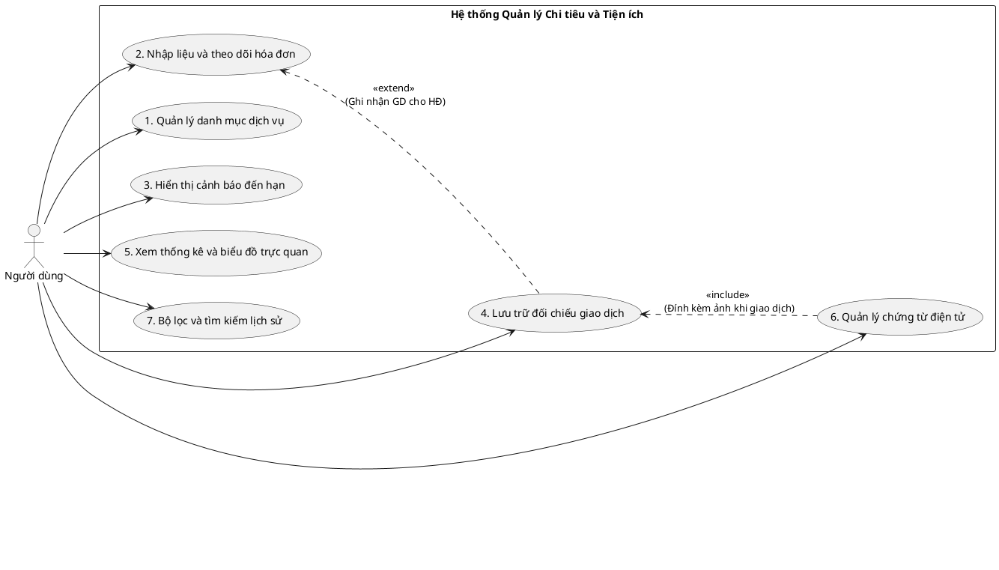
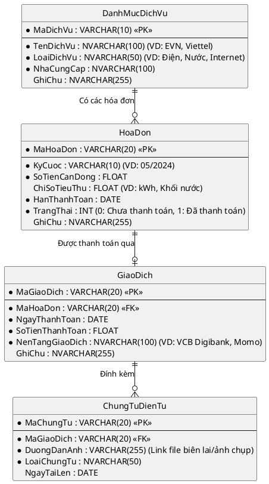
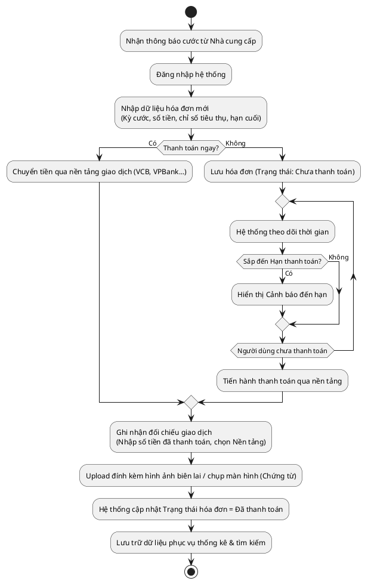
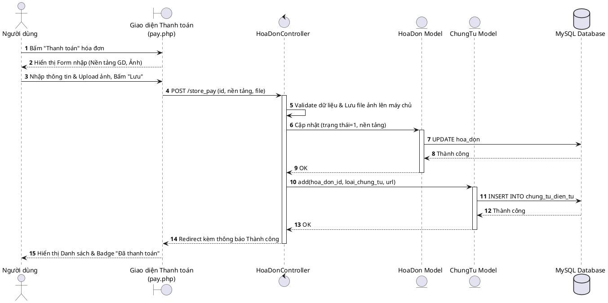
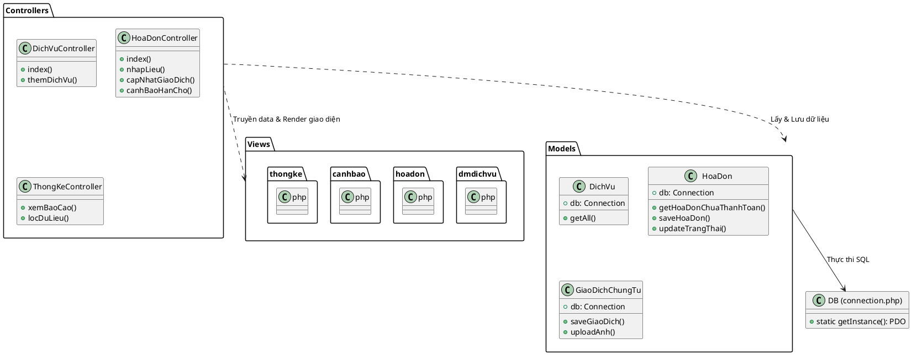

# Hệ thống Quản lý Chi tiêu và Tiện ích cá nhân

## 1. Biểu đồ Use Case 
Thể hiện tương tác của người dùng với các tính năng của hệ thống.

## 2. Biểu đồ ERD 
Được thiết kế chuẩn hóa để lưu trữ toàn bộ các thông tin từ nhà cung cấp, hóa đơn, thông số tiêu thụ cho đến đối chiếu giao dịch.

## 3. Biểu đồ Hoạt động - Quy trình quản lý 1 hóa đơn
Mô tả luồng người dùng xử lý nghiệp vụ kể từ lúc nhận thông báo đóng tiền đến lúc hoàn tất giao dịch và lưu trữ chứng từ.

## 4. Biểu đồ thanh toán  
Biểu đồ tuần tự mô tả chi tiết luồng xử lý của chức năng "Thanh toán hóa đơn"

## 5. Biểu đồ Kiến trúc MVC 
Biểu đồ này giúp hình dung luồng code phía backend.

