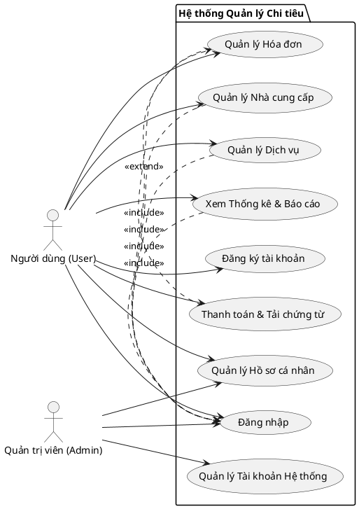
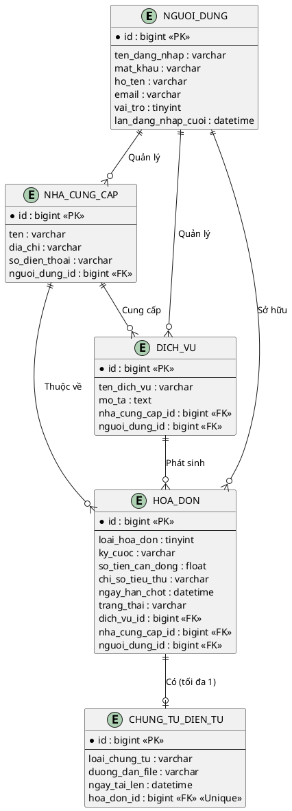
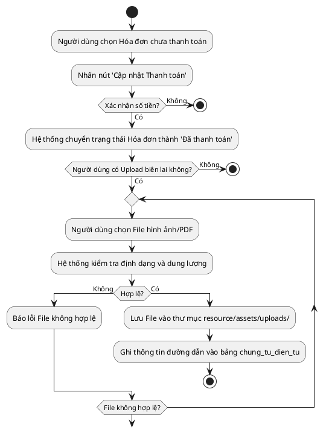
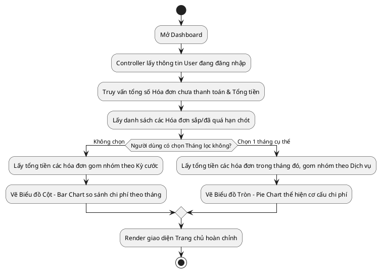

# BỘ BIỂU ĐỒ UML HỆ THỐNG QUẢN LÝ CHI TIÊU VÀ TIỆN ÍCH CÁ NHÂN

Dựa trên hệ thống thực tế đã được xây dựng, dưới đây là bộ biểu đồ UML chuẩn hóa.

## 1. Biểu đồ Use Case (Use Case Diagram)
Mô tả các chức năng mà các tác nhân (Actor) có thể thực hiện trên hệ thống. 

---

## 2. Biểu đồ Lớp / Thực thể (Class / ER Diagram)
Mô tả cấu trúc dữ liệu vật lý và các mối quan hệ (Primary Key / Foreign Key) giữa các bảng trong MySQL. Hệ thống thiết kế theo hướng Multi-tenant (mọi dữ liệu đều gắn với `nguoi_dung_id`).

---

## 3. Biểu đồ Hoạt động (Activity Diagram)

### 3.1. Luồng cập nhật trạng thái Hóa đơn & Upload Chứng từ
Mô phỏng chi tiết hành động khi người dùng thực hiện thanh toán một hóa đơn định kỳ.

### 3.2. Luồng xem Thống kê & Biểu đồ (Dashboard)
Mô phỏng logic xử lý khi người dùng vào trang chủ hoặc tiến hành lọc tháng.

