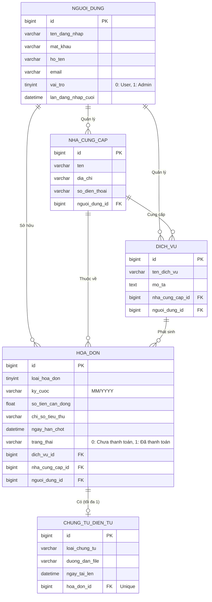
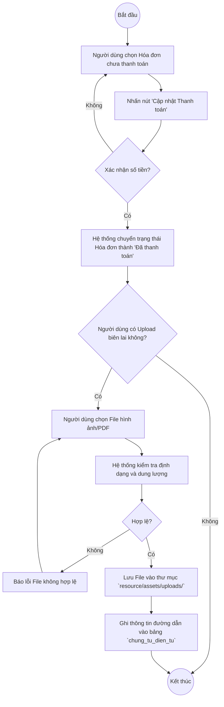
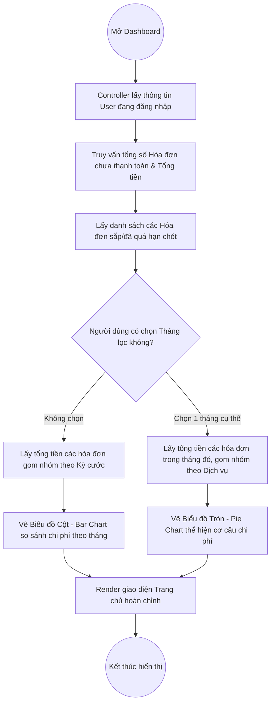

# BỘ BIỂU ĐỒ UML HỆ THỐNG QUẢN LÝ CHI TIÊU VÀ TIỆN ÍCH CÁ NHÂN

Dựa trên hệ thống thực tế đã được xây dựng, dưới đây là bộ biểu đồ UML chuẩn hóa.

## 1. Biểu đồ Use Case (Use Case Diagram)
Mô tả các chức năng mà các tác nhân (Actor) có thể thực hiện trên hệ thống. 

```mermaid
usecaseDiagram
    actor "Người dùng (User)" as User
    actor "Quản trị viên (Admin)" as Admin

    package "Hệ thống Quản lý Chi tiêu" {
        usecase "Đăng ký tài khoản" as UC1
        usecase "Đăng nhập" as UC2
        usecase "Quản lý Hồ sơ cá nhân" as UC3
        
        usecase "Quản lý Nhà cung cấp" as UC4
        usecase "Quản lý Dịch vụ" as UC5
        usecase "Quản lý Hóa đơn" as UC6
        usecase "Thanh toán & Tải chứng từ" as UC7
        usecase "Xem Thống kê & Báo cáo" as UC8
        
        usecase "Quản lý Tài khoản Hệ thống" as UC9
    }

    User --> UC1
    User --> UC2
    User --> UC3
    User --> UC4
    User --> UC5
    User --> UC6
    User --> UC7
    User --> UC8

    Admin --> UC2
    Admin --> UC3
    Admin --> UC9
    
    %% Mở rộng và bao gộp
    UC7 ..> UC6 : <<extend>>
    UC4 ..> UC2 : <<include>>
    UC5 ..> UC2 : <<include>>
    UC6 ..> UC2 : <<include>>
    UC8 ..> UC2 : <<include>>
```

---

## 2. Biểu đồ Lớp / Thực thể (Class / ER Diagram)
Mô tả cấu trúc dữ liệu vật lý và các mối quan hệ (Primary Key / Foreign Key) giữa các bảng trong MySQL. Hệ thống thiết kế theo hướng Multi-tenant (mọi dữ liệu đều gắn với `nguoi_dung_id`).



---

## 3. Biểu đồ Hoạt động (Activity Diagram)

### 3.1. Luồng cập nhật trạng thái Hóa đơn & Upload Chứng từ
Mô phỏng chi tiết hành động khi người dùng thực hiện thanh toán một hóa đơn định kỳ.



### 3.2. Luồng xem Thống kê & Biểu đồ (Dashboard)
Mô phỏng logic xử lý khi người dùng vào trang chủ hoặc tiến hành lọc tháng.


